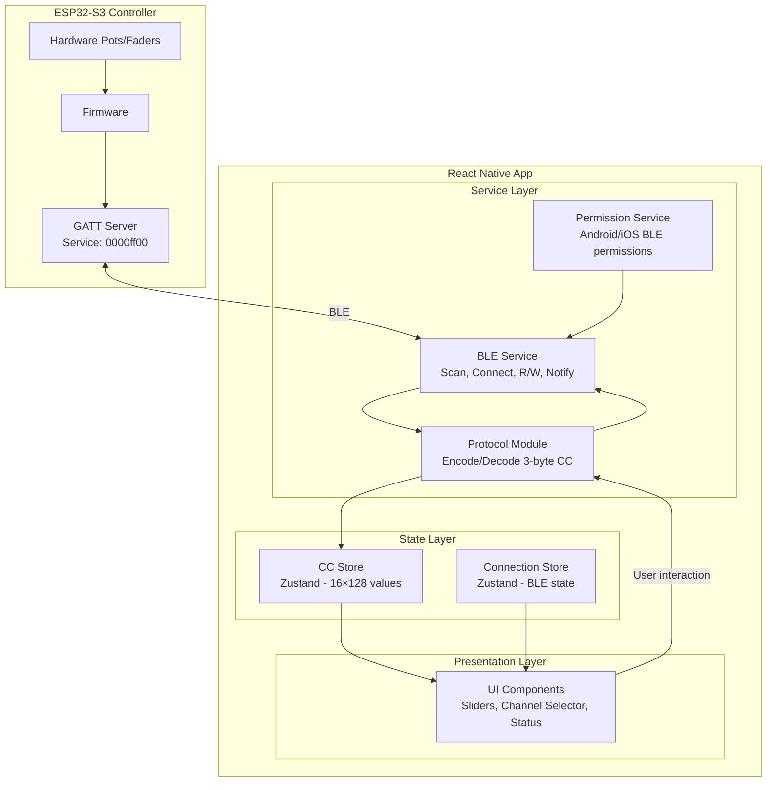
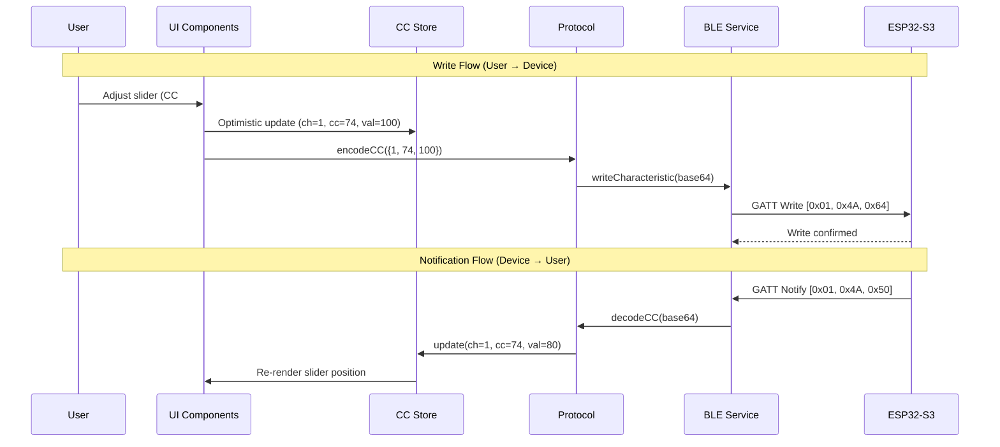
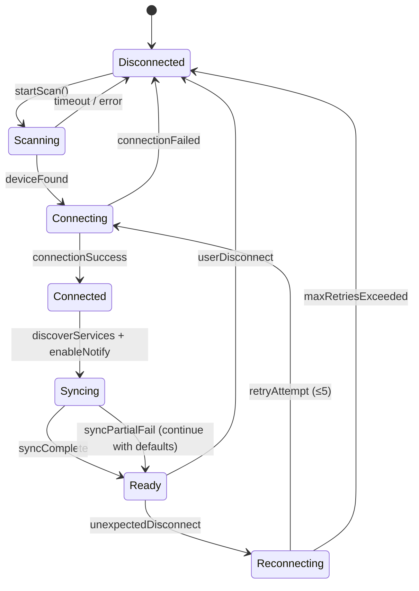

# Design Document: BLE MIDI Controller

## Overview

This design describes the architecture for a React Native (Expo SDK 54) mobile application that communicates with an ESP32-S3 BLE MIDI Controller device. The app enables users to visualize and remotely control 2048 MIDI CC parameters (16 channels × 128 controllers) over Bluetooth Low Energy using a custom GATT protocol with 3-byte binary messages.

The system follows a layered architecture separating BLE communication, protocol encoding/decoding, state management, and UI presentation. This ensures testability of the protocol layer independently from BLE I/O, and allows the UI to react to state changes regardless of their source (local user interaction or remote device notifications).

### Key Technical Decisions

| Decision | Choice | Rationale |
|----------|--------|-----------|
| BLE Library | `react-native-ble-plx` ^3.x | Most mature BLE library for React Native, has Expo config plugin, supports New Architecture |
| State Management | Zustand | Lightweight, no boilerplate, supports selectors to prevent re-renders of 2048-value store |
| Binary Encoding | `buffer` polyfill (^6.x) | Required for base64 ↔ binary conversion used by react-native-ble-plx |
| Slider Component | `@react-native-community/slider` ^4.x | Standard community slider, performant for continuous value updates |
| Build Type | Development Build (EAS) | BLE requires native code — cannot use Expo Go |
| Architecture | New Architecture (default in SDK 54) | SDK 54 is the last to support Legacy; react-native-ble-plx 3.x supports New Arch |

### Expo SDK 54 Compatibility Notes

- **React Native 0.81** with React 19.1
- **New Architecture** enabled by default (Legacy Architecture support is frozen)
- **Reanimated v4** with `react-native-worklets` (already in package.json)
- **Android targets API 36** with edge-to-edge always enabled
- **react-native-ble-plx** requires `npx expo prebuild` and a Development Build
- **Config plugin** for BLE: `react-native-ble-plx` plugin in app.json handles iOS permissions and background modes
- **Android permissions** requested at runtime via `PermissionsAndroid` (BLUETOOTH_SCAN, BLUETOOTH_CONNECT, ACCESS_FINE_LOCATION)

---

## Architecture

### High-Level System Diagram



### Data Flow Diagram



### Connection State Machine



---

## Components and Interfaces

### 1. Protocol Module (`src/ble/protocol.ts`)

Pure functions for encoding/decoding the 3-byte CC protocol. No side effects, fully testable.

```typescript
// Types
export interface CCMessage {
  channel: number;      // 1–16
  controller: number;   // 0–127
  value: number;        // 0–127
}

// Encoding
export function encodeCC(msg: CCMessage): string;           // → base64
export function encodeBulkRequest(channel: number): string; // → base64 (1 byte)

// Decoding
export function decodeCC(base64: string): CCMessage | null;
export function decodeBulk(base64: string): number[] | null; // → 128 values or null

// Validation
export function isValidCC(msg: CCMessage): boolean;
export function isValidChannel(channel: number): boolean;
export function isValidController(controller: number): boolean;
export function isValidValue(value: number): boolean;
```

### 2. BLE Service (`src/ble/ble-service.ts`)

Manages the BLE lifecycle: scan, connect, disconnect, read, write, notifications, reconnection.

```typescript
export interface BLEServiceConfig {
  scanTimeout: number;          // default: 10000ms
  connectionTimeout: number;    // default: 10000ms
  requestMTU: number;           // default: 185
  reconnectMaxAttempts: number; // default: 5
  reconnectInterval: number;    // default: 2000ms
  reconnectInitialDelay: number;// default: 1000ms
  bulkReadTimeout: number;      // default: 5000ms
  writeTimeout: number;         // default: 5000ms
}

export interface BLEService {
  // Lifecycle
  scan(): Promise<Device | null>;
  connect(device: Device): Promise<void>;
  disconnect(): Promise<void>;
  destroy(): void;

  // Operations
  writeCC(msg: CCMessage): Promise<void>;
  bulkRead(channel: number): Promise<number[]>;
  syncAllChannels(onProgress?: (channel: number) => void): Promise<(number[] | null)[]>;

  // Notifications
  enableNotifications(): Promise<void>;

  // Callbacks
  onCCNotification: ((msg: CCMessage) => void) | null;
  onConnectionStateChange: ((state: ConnectionState) => void) | null;
}
```

### 3. Permission Service (`src/services/permission-service.ts`)

Handles platform-specific BLE permission requests.

```typescript
export interface PermissionResult {
  granted: boolean;
  bluetoothEnabled: boolean;
}

export function requestBLEPermissions(): Promise<PermissionResult>;
export function checkBluetoothEnabled(): Promise<boolean>;
```

### 4. CC Store (`src/stores/cc-store.ts`)

Zustand store holding all 2048 CC values with selective subscriptions.

```typescript
export interface CCStoreState {
  // State: 16 channels × 128 controllers
  values: number[][];  // values[channelIndex][controllerNumber], channelIndex = channel - 1

  // Actions
  updateCC(channel: number, controller: number, value: number): void;
  updateChannel(channel: number, values: number[]): void;
  updateAllChannels(allValues: (number[] | null)[]): void;
  resetAll(): void;

  // Selectors
  getCC(channel: number, controller: number): number;
  getChannel(channel: number): number[];
}
```

### 5. Connection Store (`src/stores/connection-store.ts`)

Zustand store for BLE connection state.

```typescript
export type ConnectionState =
  | 'disconnected'
  | 'scanning'
  | 'connecting'
  | 'syncing'
  | 'connected'
  | 'reconnecting'
  | 'bluetooth_unavailable';

export interface ConnectionStoreState {
  state: ConnectionState;
  reconnectAttempt: number;
  syncProgress: number; // 0–16 (channel being synced)
  error: string | null;

  // Actions
  setState(state: ConnectionState): void;
  setReconnectAttempt(attempt: number): void;
  setSyncProgress(channel: number): void;
  setError(error: string | null): void;
  reset(): void;
}
```

### 6. UI Components

| Component | Path | Responsibility |
|-----------|------|----------------|
| `ConnectionStatus` | `src/components/ConnectionStatus.tsx` | Fixed header badge showing BLE state with color coding |
| `ChannelSelector` | `src/components/ChannelSelector.tsx` | Horizontal row of 16 channel buttons |
| `CCSlider` | `src/components/CCSlider.tsx` | Individual CC slider with label and numeric value |
| `CCGrid` | `src/components/CCGrid.tsx` | Scrollable list of 128 CCSliders for selected channel |
| `ScanButton` | `src/components/ScanButton.tsx` | Scan/Connect/Disconnect action button |
| `SyncProgress` | `src/components/SyncProgress.tsx` | Progress indicator during bulk sync |

### 7. Custom Hook (`src/hooks/useBLEController.ts`)

Orchestrates BLE service, stores, and reconnection logic.

```typescript
export function useBLEController(): {
  // State
  connectionState: ConnectionState;
  reconnectAttempt: number;
  syncProgress: number;
  error: string | null;

  // Actions
  scanAndConnect(): Promise<void>;
  disconnect(): Promise<void>;
  sendCC(channel: number, controller: number, value: number): Promise<void>;
  syncChannel(channel: number): Promise<void>;
};
```

---

## Data Models

### CC State Matrix

The core data structure is a 2D array representing all 2048 MIDI CC parameters:

```
values[0..15][0..127] : number (0–127)
         │         │
         │         └── Controller number (CC #0 to CC #127)
         └──────────── Channel index (0 = Channel 1, 15 = Channel 16)
```

Initial state: all values set to `0` (matches controller power-on state).

### BLE Protocol Messages

| Operation | Direction | Characteristic | Payload |
|-----------|-----------|----------------|---------|
| CC Write | App → Device | ff01 | 3 bytes: `[channel, controller, value]` |
| CC Read | App ← Device | ff01 | 3 bytes: `[channel, controller, value]` |
| CC Notify | App ← Device | ff01 | 3 bytes: `[channel, controller, value]` |
| Bulk Request | App → Device | ff02 | 1 byte: `[channel]` |
| Bulk Response | App ← Device | ff02 | 128 bytes: `[cc0_val, cc1_val, ..., cc127_val]` |

### GATT Service Structure

```
Service: 0000ff00-0000-1000-8000-00805f9b34fb
├── Characteristic: 0000ff01 (CC Read/Write/Notify)
│   ├── Properties: Read, Write, Notify
│   └── Descriptor: 00002902 (CCCD)
└── Characteristic: 0000ff02 (Bulk Read)
    └── Properties: Read, Write
```

### Connection State Model

```typescript
interface ConnectionContext {
  state: ConnectionState;
  device: Device | null;
  reconnectAttempt: number;    // 0 when not reconnecting, 1–5 during attempts
  syncProgress: number;        // 0 when idle, 1–16 during sync
  lastError: string | null;
  isUserDisconnect: boolean;   // true = don't auto-reconnect
}
```

### Validation Rules

| Field | Type | Min | Max | Notes |
|-------|------|-----|-----|-------|
| channel | uint8 | 1 | 16 | NOT zero-indexed |
| controller | uint8 | 0 | 127 | Standard MIDI CC range |
| value | uint8 | 0 | 127 | Standard MIDI value range |

---

## Correctness Properties

*A property is a characteristic or behavior that should hold true across all valid executions of a system — essentially, a formal statement about what the system should do. Properties serve as the bridge between human-readable specifications and machine-verifiable correctness guarantees.*

### Property 1: CC Message Round-Trip

*For any* valid CC message with channel in 1–16, controller in 0–127, and value in 0–127, encoding the message to base64 via `encodeCC` and then decoding it back via `decodeCC` SHALL produce a message with identical channel, controller, and value fields.

**Validates: Requirements 11.1, 11.2, 11.5, 4.1, 5.1**

### Property 2: CC Validation Rejects Invalid Messages

*For any* CC message where channel is outside 1–16, OR controller is outside 0–127, OR value is outside 0–127, OR the base64 payload decodes to fewer than 3 bytes, the `decodeCC` function SHALL return `null` and the `isValidCC` function SHALL return `false`.

**Validates: Requirements 4.4, 5.3, 5.4, 5.5, 6.3, 11.6, 11.8**

### Property 3: Bulk Read Round-Trip

*For any* array of exactly 128 values where each value is in the range 0–127, encoding the array to base64 and then decoding it via `decodeBulk` SHALL produce an array identical to the original, where the value at index N corresponds to CC controller #N.

**Validates: Requirements 11.3, 11.4, 3.2, 6.2**

### Property 4: Bulk Decode Rejects Invalid Length

*For any* base64 string that decodes to a byte array with length different from 128, the `decodeBulk` function SHALL return `null`.

**Validates: Requirements 11.7**

### Property 5: CC Store Update Correctness

*For any* valid CC message (channel 1–16, controller 0–127, value 0–127), calling `updateCC(channel, controller, value)` on the CC Store SHALL result in `values[channel - 1][controller]` being equal to `value`, while all other cells in the store remain unchanged.

**Validates: Requirements 4.2, 5.2, 3.2, 6.2**

---

## Error Handling

### Error Categories and Recovery Strategies

| Category | Trigger | Recovery | User Feedback |
|----------|---------|----------|---------------|
| Permission Denied | User denies BLE permissions | Show settings link | "Permissões necessárias para conectar" + botão configurações |
| Bluetooth Off | Adapter disabled | Monitor adapter state | "Ative o Bluetooth para conectar" |
| Scan Timeout | No device found in 10s | Allow retry | "Nenhum dispositivo encontrado" + botão repetir |
| Scan Error | BLE stack error during scan | Stop scan, allow retry | "Erro no scan" + botão repetir |
| Connection Rejected | Another client connected | Show message | "Outro dispositivo já está conectado" |
| Connection Timeout | No response in 10s | Allow retry | "Timeout de conexão" |
| Incompatible Device | ff01 characteristic missing | Disconnect | "Dispositivo não compatível" |
| Write Failure | BLE error during CC write | Rollback optimistic update | "Falha ao enviar comando" |
| Bulk Read Failure | Error or empty response | Keep previous values | Silent (log internally) |
| Unexpected Disconnect | Signal loss, controller restart | Auto-reconnect (5 attempts) | "Reconectando... (tentativa X de 5)" |
| Reconnect Exhausted | 5 failed attempts | Stop, show manual option | "Falha na reconexão" + botão reconectar |
| Sync Failure | Bulk read errors during sync | Continue with defaults (0) | Progress indicator shows partial |
| Invalid Notification | Malformed CC data received | Discard silently | None (log internally) |

### Reconnection Algorithm

```typescript
async function handleUnexpectedDisconnect(): Promise<void> {
  if (isUserDisconnect) return; // Don't reconnect on manual disconnect

  connectionStore.setState('reconnecting');
  await delay(RECONNECT_INITIAL_DELAY); // 1 second

  for (let attempt = 1; attempt <= MAX_RECONNECT_ATTEMPTS; attempt++) {
    connectionStore.setReconnectAttempt(attempt);

    try {
      await connect(lastDevice);
      await discoverServices();
      await enableNotifications();
      await syncAllChannels();
      connectionStore.setState('connected');
      return; // Success
    } catch (error) {
      if (attempt < MAX_RECONNECT_ATTEMPTS) {
        await delay(RECONNECT_INTERVAL); // 2 seconds between attempts
      }
    }
  }

  // All attempts failed
  connectionStore.setState('disconnected');
  connectionStore.setError('Falha na reconexão após 5 tentativas');
}
```

### Write Error Rollback

```typescript
async function sendCC(channel: number, controller: number, value: number): Promise<void> {
  // Validate
  if (!isValidCC({ channel, controller, value })) {
    throw new ValidationError(`Invalid CC: ch=${channel}, cc=${controller}, val=${value}`);
  }

  // Save previous value for rollback
  const previousValue = ccStore.getCC(channel, controller);

  // Optimistic update
  ccStore.updateCC(channel, controller, value);

  try {
    await bleService.writeCC({ channel, controller, value });
  } catch (error) {
    // Rollback on failure
    ccStore.updateCC(channel, controller, previousValue);
    throw error; // Propagate to UI for error display
  }
}
```

---

## Testing Strategy

### Testing Approach

This feature uses a **dual testing approach**:

1. **Property-Based Tests** — Verify universal correctness properties of the protocol module and store logic using randomly generated inputs (minimum 100 iterations per property)
2. **Unit Tests** — Verify specific behaviors, edge cases, integration points, and error handling with concrete examples
3. **Component Tests** — Verify UI rendering and interaction behavior

### Property-Based Testing Configuration

- **Library**: [fast-check](https://github.com/dubzzz/fast-check) (mature PBT library for TypeScript/JavaScript)
- **Test Runner**: Jest (via `jest-expo`)
- **Minimum iterations**: 100 per property
- **Tag format**: `Feature: ble-midi-controller, Property {N}: {description}`

Each correctness property maps to a single property-based test:

| Property | Test File | What It Generates |
|----------|-----------|-------------------|
| Property 1: CC Round-Trip | `src/ble/__tests__/protocol.property.test.ts` | Random valid CCMessage (ch 1–16, ctrl 0–127, val 0–127) |
| Property 2: Invalid CC Rejection | `src/ble/__tests__/protocol.property.test.ts` | Random invalid CCMessage (out-of-range fields, short buffers) |
| Property 3: Bulk Round-Trip | `src/ble/__tests__/protocol.property.test.ts` | Random arrays of 128 values (0–127) |
| Property 4: Invalid Bulk Rejection | `src/ble/__tests__/protocol.property.test.ts` | Random byte arrays with length ≠ 128 |
| Property 5: Store Update | `src/stores/__tests__/cc-store.property.test.ts` | Random (channel, controller, value) triples |

### Unit Test Coverage

| Module | Test Focus | Examples |
|--------|-----------|----------|
| `protocol.ts` | Edge cases: empty string, 0-byte buffer, max values | `decodeCC("")` → null, `encodeCC({1,0,0})` → valid |
| `ble-service.ts` | Connection flow, timeout, error paths | Mock BleManager, verify scan/connect/disconnect sequence |
| `permission-service.ts` | Permission grant/deny flows | Mock PermissionsAndroid, verify all paths |
| `cc-store.ts` | Atomic updates, channel replacement, reset | Verify `updateChannel` replaces all 128 values atomically |
| `connection-store.ts` | State transitions, reconnect counter | Verify valid state transitions |
| `useBLEController.ts` | Hook orchestration, error propagation | Mock BLE service, verify hook behavior |

### Component Test Coverage

| Component | Test Focus |
|-----------|-----------|
| `ConnectionStatus` | Renders correct label/color for each state |
| `ChannelSelector` | 16 buttons, selection highlight, callback |
| `CCSlider` | Value display, onSlidingComplete callback |
| `CCGrid` | Renders 128 sliders, scrollable |
| `SyncProgress` | Shows progress during sync |

### Test Dependencies

```json
{
  "devDependencies": {
    "jest-expo": "~54.0.0",
    "fast-check": "^3.x",
    "@testing-library/react-native": "^12.x",
    "@types/jest": "^29.x"
  }
}
```

### Running Tests

```bash
# All tests
npx jest --run

# Property tests only
npx jest --testPathPattern=property --run

# Unit tests only
npx jest --testPathPattern=__tests__ --run
```
